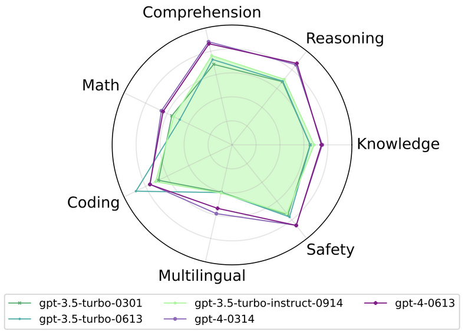
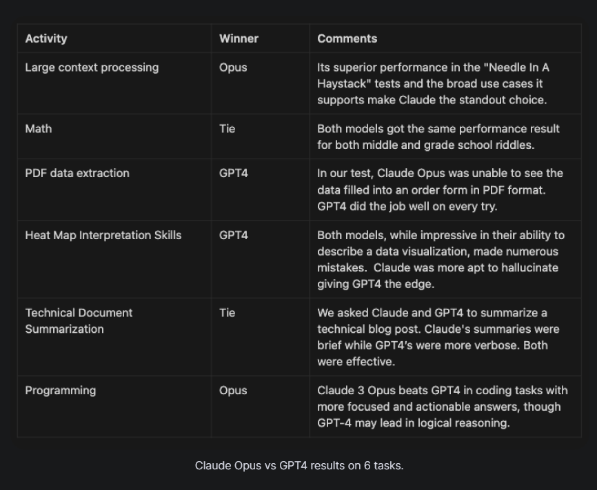
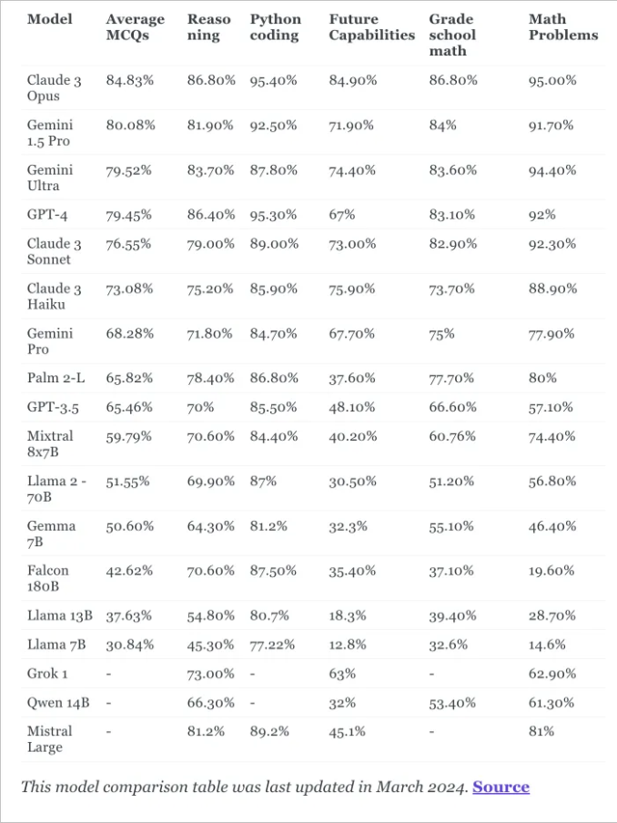
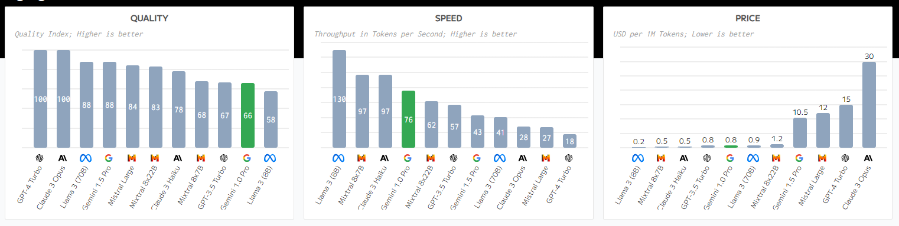
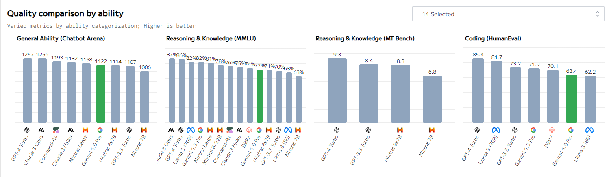

# Breef Introduction

Large language models (LLMs) are a category of foundation models trained on immense amounts of data making them capable of understanding and generating natural language and other types of content to perform a wide range of tasks. Their key difference lies in their scale, architecture, somethimes prompting techniques and ability to generalize well to diverse language tasks.

LLMs can be open-source (you can download a GGUF or EXL2 file) or they can be accessed through APIs.

## GPT models

- Developer: OpenAI

- Parameters: More than 175 billion

- Access: API

GPT is a general-purpose LLM with an API, and it's used by a diverse range of companies to power countless different tools. There are two main models currently available: GPT-3.5-turbo and GPT-4. Still, ChatGPT is probably the most popular demo of its powers.

According to OpenAI, the developer of GPT models, they do not sell user data. OpenAI is committed to user privacy and does not share user content with third parties for marketing purposes. They may use content submitted to their services like ChatGPT or DALL·E to improve model performance, but this is done with respect to the user's settings and privacy. Additionally, OpenAI's Privacy Policy states that they do not sell personal information or share it with third parties for marketing.

To access OpenAI's APIs you can create an account on the [OpenAi](https://platform.openai.com/docs/overview) platform, fund the account with a maximum of $120 at a time and create an API key to access the API, or you can create an account on the [Azure](https://learn.microsoft.com/en-us/azure/ai-services/openai/) platform offering the flexibility of both Pay-As-You-Go (PAYG) and Provisioned Throughput Units (PTUs).

- Pricing on OpenAI and Azure (Region France):

| Model                  | Parameter context | Input(Per 1M tokens)       | Output(Per 1M tokens)      |
| ---------------------- | ----------------- | -------------------------- | -------------------------- |
| gpt-4-turbo-2024-04-09 | 128k              | US$10.00                   | US$30.00                   |
| gpt-4                  | 8k                | US$30.00                   | US$60.00                   |
| gpt-4-32k              | 32k               | US$60.00                   | US$120.00                  |
| gpt-3.5-turbo-0125     | 16k               | US$0.50                    | US$1.50                    |
| gpt-3.5-turbo-instruct | 4k                | US$1.50 ( N/A - on Azure ) | US$2.00 ( N/A - on Azure ) |

- Benchmarks

[GPT-Fathom: Evaluating LLMs under Aligned Settings](https://github.com/gpt-fathom/gpt-fathom?tab=readme-ov-file#leaderboard)

## AWS Bedrock models

Bedrock is a fully managed, serverless service, that provides users access to Foundation Models (FMs) from several third-party providers and from Amazon through a single API. After you select a FM to use you can privately customize it and connect your propriety data sources and knowledge bases.

Despite the fact that bedrock benefits from a multitude of models, some have limited access for areas outside from the United States. Therefore, in order to comply with the internal .msg rules (_to be hosted in Europe_), we reduce the number to 4 models: Titan, Claude and Mistral

### 1. Amazon Titan Text

- Developer: Amazon

- Parameters: not specified

- Access: API

The model is optimized for English, with multilingual support for more than 100 additional languages. Here are some of the supported use cases for Amazon Titan Text G1 - Express:

\- Retrieval augmented generation

\- Open-ended text generation

\- Brainstorming

\- Summarizations

\- Code generation

\- Table creation

\- Data formatting

\- Paraphrasing

\- Chain of thought

\- Rewrite

\- Extraction

\- QnA

\- Chat

Additionally, there’s another variant called _Amazon Titan Text G1 - Lite_, which is a lightweight, efficient model ideal for fine-tuning English-language tasks like summarizations and copywriting. It’s a more cost-effective option that’s also highly customizable .

- Pricing - region Paris

On-Demand and Batch pricing for text models

| Amazon Titan models       | Input (Per 1M tokens) | Output (Per 1M tokens) |
| ------------------------- | --------------------- | ---------------------- |
| Amazon Titan Text Lite    | $0.2                  | $0.25                  |
| Amazon Titan Text Express | $0.25                 | $0.788                 |

- Benchmarking

There is limited available data about benchmarking Amazon Titan Text models. One of the very few available tests was conducted within the  [AWS COMMUNITY](https://community.aws/content/2b3FiirF9gbFM1Q7w1CUCDBhSwn/testing).

The existence of websites that compare generative AI models doesn't provide much information about performance either. For example, this [Amazon Titan vs. ChatGPT vs. GPT-4 Comparison Chart](https://sourceforge.net/software/compare/Amazon-Titan-vs-ChatGPT-vs-GPT-4/) is not particularly informative because the software hasn't been reviewed yet. Additionally, there are unreliable comparisons between older versions of generative AIs and the then-unreleased Bedrock.

The general available data about Amazon Titan Text models comes from the official Amazon site, which provides information regarding  [documentation](https://docs.aws.amazon.com/bedrock/latest/userguide/titan-models.html), usage, pricing, [demo](https://aws.amazon.com/bedrock/titan/), [prompt engeneering](https://d2eo22ngex1n9g.cloudfront.net/Documentation/User+Guides/Titan/Amazon+Titan+Text+Prompt+Engineering+Guidelines.pdf), and more.

### 2. Claude

- Developer: Anthropic

- Parameters: over 130 bilion

- Access: API

Claude boasts a wide context size, allowing it to consider a large amount of surrounding text when generating responses.
Depending on the specific model variant, Claude’s context window ranges from 100,000 to 200,000 tokens. This makes it excellent at parsing and analyzing long documents and strings of text.

_When interacting with Claude, it’s best to provide long documents or text before instructions or user input. The model pays extra attention to text near the bottom of the prompt._

Capabilities:

\- Claude generates non-toxic, safe, and helpful output by following ethical rules set by the developers.

\- Users can input up to 100,000 tokens, allowing them to analyze hundreds of pages of documents with a single query.

Claude 3 model family is the next generation of Anthropic's LLMs. This family includes three state-of-the-art models in ascending order of capability: Claude 3 Haiku, Claude 3 Sonnet, and Claude 3 Opus.

- Pricing

Claude 3/ Claude 2.1 context window - 200,000 token
Claude 2.0 / Claude Instant context window - 100,000 token

| Claude models   | Input (Per 1M tokens) | Output (Per 1M tokens) |
| --------------- | --------------------- | ---------------------- |
| Claude 3 Opius  | $15                   | $75                    |
| Claude 3 Sonnet | $3                    | $15                    |
| Claude 3 Haiku  | $0.25                 | $1.25                  |
| Claude 2.1      | $8                    | $24                    |
| Claude 2.0      | $8                    | $24                    |
| Claude Instant  | $0.80                 | $2.40                  |

On AWS only **Claude 3 Sonnet and Haiku** are available in region Europe (Paris).

- Benchmarking

A comparation between GPT-4 and Claude 3 Opus

The statistics of benchmarks, incorect refusals ("Previous Claude models often made unnecessary refusals that suggested a lack of contextual understanding" - Claude considering that conversations will lead to harmfull subjects) and accuracy can be seen on [Anthropic Website](https://www.anthropic.com/news/claude-3-family).

### 3. Mistral

- Developer: Mistral AI

- Parameters: up to 7.3 bilion

- Access: API

Both Mistral 7B and Mixtral 8x7B are good at code generation tasks like HumanEval and MBPP, with Mixtral 8x7B having a slight edge and it’s better. Mixtral 8x7B also supports multiple languages, including English, French, German, Italian, and Spanish, making them valuable assets for multilingual applications.

On the MMLU benchmark, which evaluates a model’s reasoning and comprehension abilities, Mistral 7B performs equivalently to a hypothetical Llama 2 model over three times its size.

- Pricing

| Mistral models | Input (Per 1M tokens) | Output (Per 1M tokens) |
| -------------- | --------------------- | ---------------------- |
| Mistral 7B     | $0.0002               | $0.00026               |
| Mixtral 8x7B   | $0.00059              | $0.00091               |
| Mistral Large  | $0.0104               | $0.0312                |

- Benchmarking

According to Mistral AI’s benchmarks, Mixtral 8x7B outperforms or matches the large language models like Llama 2 70B and GPT-3.5 across most multiple tasks, including reasoning, mathematics, code generation, and multilingual benchmarks. Additionally, it provides 6x faster inference than Llama 2 70B, thanks to its sparse architecture.

LLMs Benchmark Comparison Table

## Gemini Pro 1.0

- Developer: Google

- Parameters: up to 60 bilion

- Access: API

- Context window: 32.8k tokens.

- Pricing

| Gemini models  | Input (Per 1M tokens)   | Output (Per 1M tokens)  |
| -------------- | ----------------------- | ----------------------- |
| Gemini Pro 1.0 | free of charge\* / $0.5 | free of charge\* / $1.5 |

**\*Prompts/responses used to improve their products**

- Benchmarking

Gemini Pro 1.5 has astonishing improvements but is not available in Europe.

For other interesting graphs and benchmarks you can visit [Artificial Analysis](https://artificialanalysis.ai/models/gemini-pro)

## LLMs not available in Europe

### Meta Models

- Meta states that  Llama 3 performs better than most current AI models.

### Google's Bard

- Google’s Bard chatbot is not available in Canada and Europe. The company has hinted at regulatory reasons for this issue, and it is believed to be because of General Data Protection Regulation (GDPR).

## Comparations

- [Comparing Sentiment Analysis Tools: Claude 3, ChatGPT & Gemini](https://mistral-7b.com/comparing-sentiment-analysis-tools-claude-3-chatgpt-gemini/)
- [Claude 3 Opius vs. ChatGPT-4 on Chatbot Arena](https://www.tomsguide.com/ai/claude-takes-the-top-spot-in-ai-chatbot-ranking-finally-knocking-gpt-4-down-to-second-place)
- [Artificial Analysis](https://artificialanalysis.ai/models)
- [An In-depth Comparison: ChatGPT vs. Claude vs. Bard](https://gowinston.ai/an-in-depth-comparison-chatgpt-vs-claude-vs-bard/)

## Useful Links

- [7 Large Language Model (LLM) APIs](https://nordicapis.com/7-large-language-model-llm-apis/)
- [Open-source LLMs](https://github.com/eugeneyan/open-llms)
- [LLM Comparison](https://www.reddit.com/r/LocalLLaMA/comments/18w9hak/llm_comparisontest_brand_new_models_for_2024/)
- [Llm apis](https://llmapis.io/)
- [GPT-Fathom: Evaluating LLMs under Aligned Settings](https://github.com/gpt-fathom/gpt-fathom?tab=readme-ov-file#gpt-fathom-evaluating-llms-under-aligned-settings)
