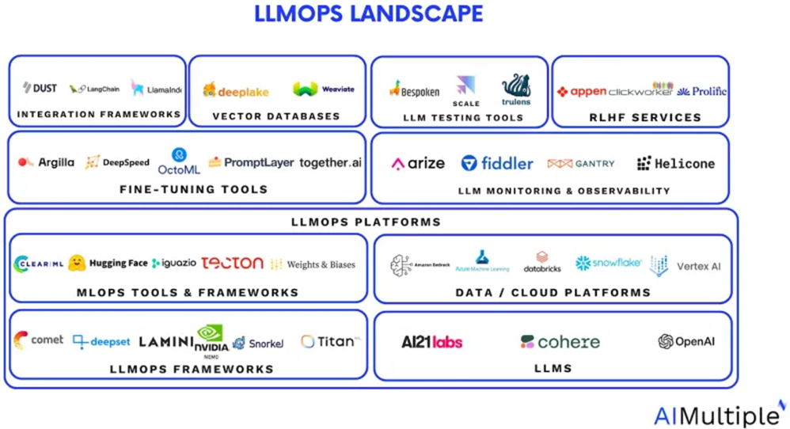
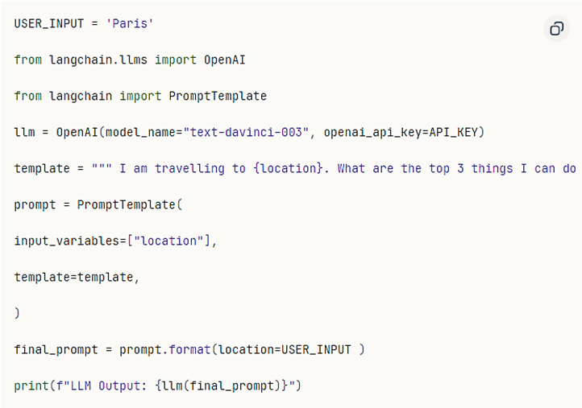
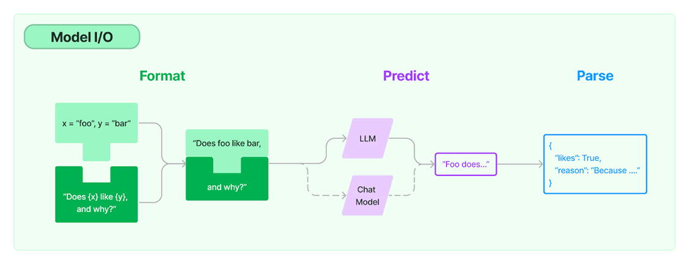
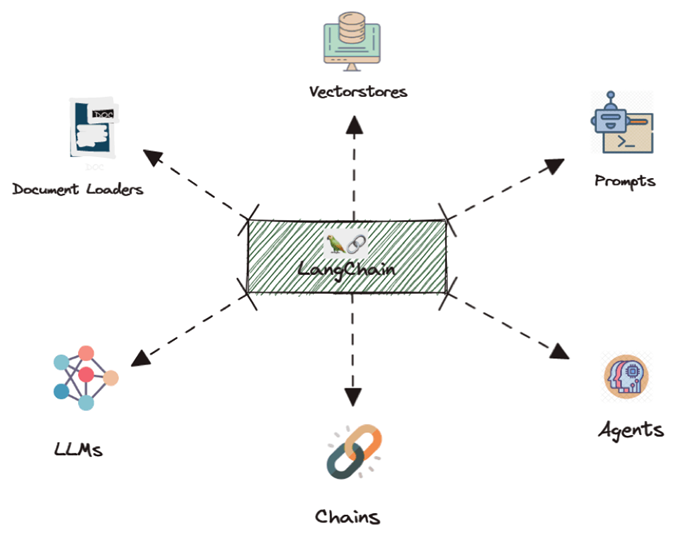
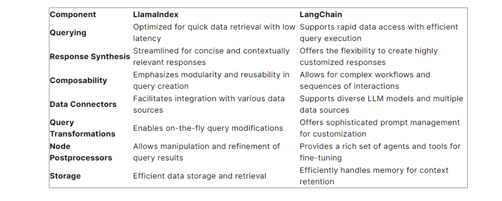
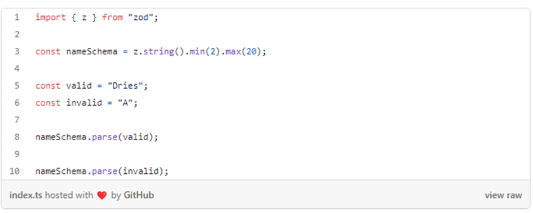
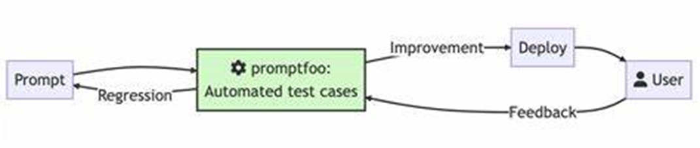

# Orchestration Frameworks

## Abstract

Large language models (LLMs) play a crucial role in modern generative AI, but their effectiveness can be significantly enhanced by using LLM orchestration frameworks and libraries. LLM app frameworks refer to a set of tools and technologies designed to streamline and enhance the development of AI applications.
The choice of LLM orchestration framework will depend on the application’s specific needs. We should consider factors such as the types of LLMs being used, the complexity of the application, and the desired level of control over the orchestration process.

## How it works

LLM frameworks provide a high-level interface for managing and controlling large language models. They abstract away the complexities of prompt generation, resource management, and performance monitoring to enable developers to interact with LLMs easily.
\
\
\

Numerous orchestration frameworks are accessible. These frameworks have various purposes such as testing, integration, and deployment, offering a comprehensive ecosystem of options. These constitute a dynamically evolving segment of the generative AI landscape, particularly with the rise in popularity of LLMs, therefore the validity of the information described in this research may change over time.

<h3>1. LangChain – integration framework</h3>

LangChain is one of the most popular integration frameworks. It began as an open-source project, but as the GitHub stars piled up, it was quickly turned into a company led by Harrison Chase.
It is essentially a library of abstractions for Python and Javascript, representing common steps and concepts necessary to work with language models. It creates a workflow by chaining together a sequence of components called links. Each link in the chain does something specific, such as:

- Formatting of user input
- Using a data source
- Referring to a linguistic model
- Processing the language model’s output
  The links in a chain are connected in a sequential manner, with the output of one link serving as the input to the next. By chaining together small operations, the chain can do more complex tasks.

Some of the most used components for creating an LLM based application with LangChain, that we also used in developing our application, are:

**LLMs**

Naturally, LangChain calls for LLMs – large language models that are trained on vast text and code datasets. You can use them to generate text, translate languages, and answer queries, among other things.

**Prompt templates**

Prompt templates are used to format user input so that the language model can understand it. You can use them to provide context for the user’s input or to describe the job that the language model should complete.

**Output parsers**

LLM output parsers are in charge of formatting the replies they generate. They can adjust the structure of the response, eliminate undesired stuff, or add extra information. Output parsers are key to ensuring that the LLM’s replies are simple to interpret and apply.

**Indexes**

Indexes are databases that hold information about the training data for the LLM. This data can comprise the text of the documents, their metadata, and their connections.

**Retrievers**

Retrievers are algorithms that look for specific information in an index. You can use them to locate documents that are relevant to a user’s query or documents that are most similar to a particular file. Retrievers are critical for increasing the LLM’s response speed and accuracy.

**Vector store**

A vector store houses mathematical representations of words and phrases. It comes in handy for tasks like answering questions and summarizing. A vector database, for example, can be used to locate all words that are comparable to the word “cat.”

**Agents**

Agents are programs that can reason about issues and divide them into smaller subtasks. You can use an agent to direct the flow of a chain and decide which jobs to do – for example, assess whether a language model or a human expert is best suited to answer a user’s inquiry.

Nearly any LLM can be used in LangChain. Importing language models into LangChain is easy, provided you have an API key. The LLM class is designed to provide a standard interface for all models.

#### LangChain Use Cases

LangChain can be used for a wide variety of applications, including:

1. Creating summarizing systems capable of producing summaries of news articles, blog entries, and other sorts of text
2. Translate text from one language to another
3. Answer questions comprehensively and informally
4. Chatbots that engage in natural and meaningful conversations with users
5. Create data analysis tools that assist users in understanding the links between various data pieces

#### LangChain Advantages

- Scalability: LangChain can be particularly useful in the complex field of data science.
- Adaptability: The framework’s adaptability allows it to be used to develop a wide range of applications, from chatbots to question-answering systems.
- Extensibility: Developers may add their own features and functionality to the framework because it is expandable.
- Flexibility: It allows developers to chain together different components to create more advanced use cases around LLMs.
- Open source: LangChain is an open-source framework that is free to use and modify.
- Community: There is a huge and active community of LangChain users and developers that can assist and support you.
- Integrations: LangChain may be integrated with various frameworks and libraries.

#### LangChain Limitations / Disadvantages

- Data and Computational Resource Requirements: Utilizing large language models effectively in LangChain demands substantial data and computational resources.
- Limited Support for Non-Python Languages: As a Python library, LangChain may not be ideal for developers preferring other programming languages. You can't use all of LangChain's capabilities because some, like LangChain Templates or LangSmith, are only for Python.
- Documentation Limitations: Some users have reported that LangChain's documentation is not comprehensive enough, potentially making it more challenging for beginners to use.

#### LangChain Alternatives

1. LlamaIndex

Unlike LlamaIndex’s focus on search-centric applications, LangChain excels in scenarios demanding complex interactions, such as chatbots, memory recall, and question summarization.

2. NeMo Guardrails
   NeMo Guardrails helps enterprises keep applications built on large language models aligned with their safety and security requirements.
   NeMo Guardrails enables developers to set up three kinds of boundaries:

- Topical guardrails prevent apps from veering off into undesired areas. For example, they keep customer service assistants from answering questions about the weather.
- Safety guardrails ensure apps respond with accurate, appropriate information. They can filter out unwanted language and enforce that references are made only to credible sources.
- Security guardrails restrict apps to making connections only to external third-party applications known to be safe.
  It can run on top of LangChain, an open-source toolkit that developers are rapidly adopting to plug third-party applications into the power of LLMs.

<h3>2. ZOD – parser library</h3>

While there are many TypeScript schema validation libraries out there, Zod is one of the best. When choosing a library for your project, you should consider its implementation details in addition to its feature set.
Zod has zero dependencies which means that you can install and use Zod without any other libraries, and it will help you keep your bundle size smaller.
Zod works in Node.js and all major browsers (including IE 11). This makes it a good choice for projects that need to support a wide range of platforms.
Zod is designed to be TypeScript-first, meaning that the library will automatically infer the static TypeScript type for your data structures. This eliminates the need to declare types twice - once in Zod and again in TypeScript. It will save you a lot of typing and will help you keep your code changes in sync.
Zod’s API is concise and chainable. This makes it easy to create complex data schemas. You can also easily compose simpler schemas into more complex data ones.

<h3>3. Promptfoo – (LLM) testing library</h3>

Promptfoo is a versatile and indispensable library designed specifically for testing and optimizing LLM prompts. This powerful tool empowers users to evaluate prompt quality and enhance model outputs, ultimately leading to improved results in various applications. 
With features such as test case creation, customizable evaluation metrics, and side-by-side prompt and model comparisons, Promptfoo simplifies the fine-tuning process and ensures objective decision-making. Its proven trustworthiness, with over 10 million users in the LLM community, solidifies its reputation as a valuable resource for achieving superior LLM prompt quality.
Promptfoo offers a versatile suite of assertions to evaluate LLM outputs against predefined conditions or expectations, ensuring the outputs meet specific quality standards. These assertions are categorized into deterministic eval metrics and model-assisted eval metrics:

**Cost Assertion**
The cost assertion verifies if the inference cost of generating an output is below a predefined threshold.

**Contains-JSON Assertion**
This assertion (contains-json) checks whether the output contains valid JSON that matches a specific schema. It's particularly useful for structured data outputs, ensuring they adhere to the expected format.

**Answer-Relevance Assertion**
The answer-relevance assertion evaluates whether the LLM output is relevant to the original query or topic. This ensures that the model's responses are on-topic and meet the user's intent.

**Model-Graded-ClosedQA Assertion**
This assertion uses Closed QA methods (based on the OpenAI Evals) to ensure that the output adheres to specific criteria. It's beneficial for factual correctness and thematic relevance.

Promptfoo produces matrix views that enable quick evaluation of outputs across multiple prompts and inputs in the terminal, as well as a web UI for more in-depth exploration of the test results. These features are invaluable for spotting trends, understanding model strengths and weaknesses, and making informed decisions about which LLM to use for your specific application.

 
#### Promptfoo Use Cases

1.	Perform side-by-side comparisons of LLM outputs to detect quality variances and regressions.
2.	Utilize caching and concurrent testing to expedite evaluations.
3.	Automatically score outputs based on predefined expectations.
4.	Integrate Promptfoo into existing workflows either as a CLI or a library.
5.	Work with a wide range of LLM APIs, including OpenAI, Anthropic, Azure, Google, HuggingFace, open-source models like Llama, and even custom API providers.

#### Promptfoo Advantages

- Factuality Evaluation: Evaluate the factual accuracy of LLM-generated responses.
- Hallucination Reduction: Minimize the occurrence of hallucinated information in LLM outputs.
- Customizable Metrics: Promptfoo offers flexibility in defining evaluation metrics, aligning assessments with specific objectives.
- Prompt and Model Comparison: Users can objectively compare prompts and model outputs side-by-side for informed decision-making.
- Integration-friendly: Seamlessly integrates into existing testing or continuous integration workflows, enhancing efficiency.
- Web Viewer and CLI: Provides both a web viewer and command-line interface for user convenience.
- Proven Reliability: Trusted by LLM applications serving over 10 million users, highlighting its reliability in the LLM community.
- Community Collaboration: Leverage the GitHub and Discord communities for support and collaboration.
- Language Agnostic: Work in Python, JavaScript, or your preferred language.

#### Limitations / Disadvantages

While LLM benchmarks are undoubtedly helpful in general, the best practice is to use them as a guide – or at best a strong indicator – of a model’s capabilities, and not a definitive one.
An issue with LLM benchmarks is that a model’s score may not accurately reflect how it will perform when applied to a real-world use case. Benchmarking takes place in controlled settings, with a finite dataset, and with evaluators looking for a model to fulfil specific criteria. This stands in contrast to the unpredictability and variety of real-world applications, which makes it difficult to predict the “in-field” performance of a particular LLM. 

#### Promptfoo Alternatives

1.	GPT Cheat Sheet – A collection of ChatGPT prompts | FREE
2.	AIPRM – AI Prompt Manager
3.	FlowGPT – ChatGPT Prompt Generator & AI Prompts Community

## Useful Links

1.	LangChain Documentation - https://js.langchain.com/docs/get_started/introduction
2.	What Is LangChain: Components, Benefits & How to Get Started - https://lakefs.io/blog/what-is-langchain-ml-architecture
3.	Learn The Power Of LangChain: A Comprehensive Guide To Building Custom Q&A Chatbots - https://datasciencedojo.com/blog/understanding-langchain/
4.	Zod Documentation - https://zod.dev/
5.	Promptfoo Documentation - https://promptfoo.dev/docs/intro/
6.	How to use Promptfoo for LLM testing - https://dev.to/stephenc222/how-to-use-promptfoo-for-llm-testing-5dog

## Appendices

LLM orchestration - the process of managing and controlling large language models in a way that optimizes their performance and effectiveness. 
LLM benchmark - a standardized performance test used to evaluate various capabilities of AI language models. 

---

_Written by Larisa Nichitoaia_
