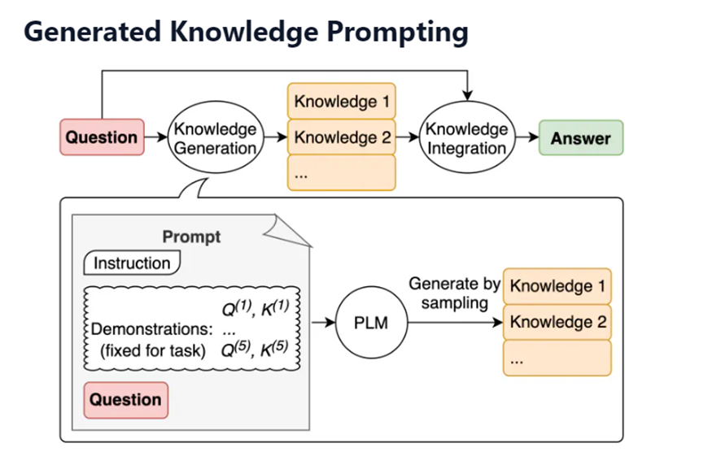

# Prompting Techinques

## Abstract

Prompt engineering involves designing queries for large language models (LLMs) to generate desired outputs. Prompt patterns are instructions guiding AI responses for specific tasks and are defined by core contextual statements that enhance the precision and relevancy of an output from an LLM.

## How it works

<details>
<summary><h3>1. Chain-Of-Thought Prompting </h3></summary>

_Definition_

```
Intuitively we as humans break a larger task or problem into sub-tasks, and then we chain these sub-tasks together.
Using the output of one sub-task as the input for the next sub-task.
This is what Chain-Of-Thought Prompting does, by giving him an example of this thought process beforehand or giving appropriate instructions.
```

_Example_


</details>

<details>
<summary><h3>2. Least-To-Most Prompting </h3></summary>

_Definition_

```
The process of inference is reaching a conclusion based on evidence and reasoning.
And in turn reasoning can be engendered with LLMs by providing the LLM with a few examples on how to reason and use evidence.
This method is underpinned by the following strategy:
•	Decompose a complex problem into a series of simpler sub-problems.
•	And subsequently solving for each of these sub-questions.

```

_Example_


_Difference between Chain-of-Thought and Least-To-Most Prompting_


</details>

<details>
<summary><h3>3. Iterative Prompting</h3></summary>

_Definition_

```
Iterative prompting is a method designed to guide thought processes by providing contextually relevant prompts.
By doing so, it helps prevent the inclusion of irrelevant information or imaginative scenarios.
This approach is interactive and adapts to the specific context of the situation, ensuring that prompts are tailored to the ongoing discussion or problem-solving process.
```

_Example_


</details>

<details>
<summary><h3>4. Self-Ask Prompting</h3></summary>

_Definition_

```
Self-Ask Prompting is a technique in which the user prompts the assistant to ask themselves follow-up question and provide intermediate answers to reach a final one.
The model might not have the direct answer to a question, but answers to sub-questions will guide it to the solution.
```

_Example_


</details>

<details>
<summary><h3>5. Meta-Prompting</h3></summary>

_Definition_

```
Definition:
The key principle underpinning Meta-Prompting is to cause the agent to reflect on its own performance and amend its own instructions accordingly.

```

_Example_


</details>

<details>
<summary><h3>6. ReAct</h3></summary>

_Definition_

```
The idea of ReAct is to combine reasoning and acting.
Reasoning enables the model to induce, track and update action plans, while actions allow for gathering additional information from external sources.
The first step is to select cases from a training set and compose ReAct-format trajectories.
These are used as few-shot exemplars in the prompts.
The trajectories consist of multiple thought-action-observation steps.
In practice, we have tools like LangChain with which we can leverage the power of ReAct by using Agents.
```

_Example_


</details>

<details>
<summary><h3>7. Symbolic Reasoning & PAL</h3></summary>

_Definition_

```
LLMs should not only be able to perform mathematical reasoning, but also symbolic reasoning which involves reasoning pertaining to colors and object types.
```

_Example_


</details>

<details>
<summary><h3>8. Self-Consistency</h3></summary>

_Definition_

```
With Chain-Of-Thought reasoning a path of thought is generated which then in turn is followed.
And on the contrary, self-consistency leverages the intuition that a complex reasoning problem typically admits multiple different ways of thinking leading to its unique correct answer.
The self-consistency method is constituted by three steps:
•	Prompt the LLM to generate a chain of thought (CoT) reasoning part.
•	Generate a diverse set of reasoning paths.
•	Select the most consistent output for the final answer.

```

_Example_


</details>

<details>
<summary><h3>9. Automatic Reasoning & Tool Use (ART)</h3></summary>

_Definition_

```
It has been illustrated that Chain of Thought prompting elicits complex and sequential reasoning from LLMs.
It has also been proven that for each step external tools can be used to improve the specific node’s generated output.
The approach of ART strongly reminds of the principle of Agents, that of decomposing a problem, and making use of tools for each decomposed step.
ART works as follows:
•	Given a new task, it selects demonstrations of multi-step reasoning and tool use from a task library.
•	At test time, it pauses generation whenever external tools are called, and integrate their output before resuming generation.

```

_Example_


</details>

<details>
<summary><h3>10. Generated Knowledge</h3></summary>

_Definition_

```
Knowledge generation prompting is a technique that utilizes the AI model's ability to generate knowledge for solving specific tasks.
By providing the model with demonstrations and guiding it towards a particular problem, the AI can generate knowledge that is then used to answer the task at hand.
This technique can be combined with external sources, such as APIs or databases, to further enhance the AI's problem-solving abilities. Knowledge generation prompting has two core steps:
•	Knowledge generation - evaluate what the LLM already knows about the topic/subtopic as well as related ones.
•	Knowledge integration at inference time (during prompting via direct input data, API or database) - supplement the LLM's knowledge on the topic/subtopic.


```

_Example_



</details>

## Remarks

When the prompts are written, it is advised to use the following tactics for a better output:

- [Include details in your query to get more relevant answers](https://platform.openai.com/docs/guides/prompt-engineering/tactic-include-details-in-your-query-to-get-more-relevant-answers)
- [Ask the model to adopt a persona](https://platform.openai.com/docs/guides/prompt-engineering/tactic-ask-the-model-to-adopt-a-persona)
- [Use delimiters to clearly indicate distinct parts of the input](https://platform.openai.com/docs/guides/prompt-engineering/tactic-use-delimiters-to-clearly-indicate-distinct-parts-of-the-input)
- [Specify the steps required to complete a task](https://platform.openai.com/docs/guides/prompt-engineering/tactic-specify-the-steps-required-to-complete-a-task)
- [Provide examples](https://platform.openai.com/docs/guides/prompt-engineering/tactic-provide-examples)
- [Specify the desired length of the output](https://platform.openai.com/docs/guides/prompt-engineering/tactic-specify-the-desired-length-of-the-output)

## Implementations

Prompt engineering frameworks are systematic approaches or methodologies used to design, refine, and optimize prompts for language models, particularly large language models (LLMs) like GPT (Generative Pre-trained Transformer) models. These frameworks provide guidelines and techniques for crafting effective prompts that elicit desired responses from the model. Here are some prominent prompt engineering frameworks:

1. APE: Action, Purpose, Expectation

- Action: Define the job or activity to be done.
- Purpose: Discuss the intention or goal.
- Expectation: State the desired outcome.

_Example_


2.  RACE: Role, Action, Context, Expectation

- Role: Specify the role of ChatGPT (or other provider)
- Action: Detail what action is needed.
- Context: Provide relevant details of the situation.
- Expectation: Describe the expected outcome.

_Example_


3. COAST: Context, Objective, Actions, Scenario, Task

- Context: Set the stage for the conversation.
- Objective: Describe the goal.
- Actions: Explain the actions needed.
- Scenario: Describe the scenario.
- Task: Describe the task.

_Example_


4. TAG: Task, Action, Goal

- Task: Define the specific task.
- Action: Describe what needs to be done.
- Goal: Explain the end goal.

_Example_


5. RISE: Role, Input, Steps, Expectation

- Role: Specify the role of ChatGPT.
- Input: Describe the information or resources.
- Steps: Ask for detailed steps.
- Expectation: Describe the desired result.

_Example_


6. TRACE: Task, Request, Action, Context, Example

- Task: Define the specific task.
- Request: Describe what you are asking for.
- Action: State the action you need.
- Context: Provide the context or situation.
- Example: Give an example to illustrate your point.

_Example_


7. ERA: Expectation, Role, Action

- Expectation: Describe the desired result.
- Role: Specify the role of ChatGPT.
- Action: Specify what actions need to be taken.

_Example_


8. CARE: Context, Action, Result, Example

- Context: Set the stage or context for the discussion.
- Action: Describe what you want to be done.
- Result: Describe the desired outcome.
- Example: Give an example to illustrate your point.

_Example_


9. ROSES: Role, Objective, Scenario, Expected Solution, Steps

- Role: Specify ChatGPT's role.
- Objective: State the goal or aim.
- Scenario: Describe the situation.
- Solution: Define the desired outcome.
- Steps: Ask for actions needed to reach the solution.

_Example_


## Advantages

1. Improved Control:

- Provides specific instructions or cues.
- Enables targeted and relevant responses.

2. Enhanced Performance:

- Optimizes accuracy, coherence, and relevance.
- Particularly beneficial for fine-tuning on specialized domains.

3. Task Adaptability:

- Repurposes pre-trained models for various tasks.
- Minimizes the need for extensive retraining or domain-specific data.

4. Reduced Bias and Harmful Content:

- Mitigates bias and harmful content generation.
- Guides the model towards neutral or contextually appropriate responses.

5. Efficient Resource Utilization:

- Optimizes performance with fewer computational resources.
- Utilizes fine-tuning and prompt tuning methodologies.

6. User Interaction and Feedback Integration:

- Integrates user input seamlessly into the generation process.
- Refines outputs iteratively based on user preferences.

7. Interpretability and Explainability:

- Facilitates better understanding of model outputs.
- Provides clear cues or context for generated responses.

8. Scalability and Generalization:

- Supports scalable deployment across different tasks and languages.
- Streamlines adaptation with standardized prompt design patterns and tuning methodologies.

## Limitations/Disadvantages

1. Length Constraints: Many language models have limitations on the length of the input prompt they can accept. For example, GPT-3 has a maximum token limit (e.g., 4096 tokens for the largest model). This means that complex or lengthy prompts may need to be truncated or shortened, potentially losing context and affecting the quality of responses.
2. Complexity of Task: If a task or question is highly complex, it may be challenging to craft a concise and effective prompt that accurately conveys the desired context and information. The model may struggle to provide meaningful responses to such prompts.
3. Ambiguity: Language is inherently ambiguous, and prompts may inadvertently introduce ambiguity or vagueness, leading to responses that are not as specific or accurate as desired. Ambiguous prompts can result in unpredictable model behavior.
4. Bias and Fairness: Crafting prompts that avoid bias and promote fairness can be difficult. Biased language or framing in prompts can lead to biased responses from the model. Achieving fairness in prompt engineering requires careful consideration of language and context.
5. Overfitting: Overfitting occurs when prompts are too tailored to a specific dataset or context, causing the model to perform poorly on general tasks or in different scenarios. Prompts should strike a balance between specificity and generalizability.
6. Lack of Creativity: Overly prescriptive prompts can limit the model's ability to generate creative or novel responses. If prompts are too rigid, the model may produce repetitive or uninteresting output.
7. Semantic Understanding: Language models like GPT-3 may not have a deep understanding of the world or context, and they rely heavily on the input provided. Crafting prompts that effectively communicate context or nuances can be challenging, especially for complex or domain-specific tasks.
8. Evaluation Challenges: Evaluating the quality of prompts and the resulting responses can be subjective and time-consuming. There may not always be clear criteria for assessing the effectiveness of a prompt.
9. Ethical Considerations: Crafting prompts that align with ethical guidelines and avoid harmful or biased content is a crucial concern. Ensuring responsible prompt engineering requires careful thought and consideration.
10. Resource Intensity: Developing effective prompts can be resource-intensive, especially for complex tasks. It may require domain expertise and iterative experimentation to find the right prompts that yield desired results.

## Useful Links

https://www.promptingguide.ai/

https://learn.deeplearning.ai/chatgpt-prompt-eng/lesson/1/introduction

https://learn.deeplearning.ai/chatgpt-building-system/lesson/1/introduction

https://platform.openai.com/docs/guides/prompt-engineering/six-strategies-for-getting-better-results

https://medium.com/@cobusgreyling/12-prompt-engineering-techniques-644481c857aa

https://www.linkedin.com/pulse/9-frameworks-master-chatgpt-prompt-engineering-edi-hezri-hairi

---

_Written by Mark Doszlop_
