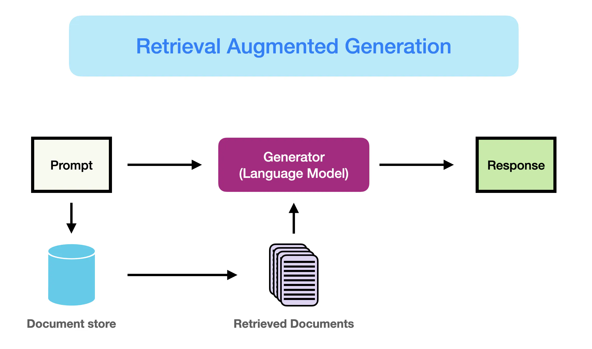

# Retrieval Augmented Generation (RAG)

## Abstract

Some of the challenges that come with working with LLMs include domain knowledge gaps, factuality issues, and
hallucinations. To mitigate some of these issues, it is possible to enhance, augment, LLMs with external knowledge
sources, such as databases.

## How it works


Starting with a prompt, a query is generated and used to identify the relevant documents, having the results then used
to generate the answer

Here is an such example:


### Retrieval

Main Scope :  _retrieving highly relevant context_


Enhancements Directions:

* Enhancing Semantic representations:
    * Chunking - take into account length of user questions and token limit in whether to choose a sentence transformers
    * Fine-tuned Embedding Models - for specialized domains to optimize retrieval relevance (FlagEmbedding)
* Aligning Queries and Documents - when the queries lack semantic information or the phrasing is imprecise
    * Query Rewriting
    * Embedding Transformations
* Aligning Retriever with the preferences of the LLM
    * Fine-tuning Retriever
    * Adapters

### Augmentation

Main Scope:  _effectively integrating context from retrieved passages with the current generation task_


### Generation

Main Scope: _converting the retrieved information into a coherent text that will form the final output of the model_


## RAG Paradigms


1. **Naive RAG**: _a user input is used to query relevant document and combined with a prompt_
    * low precision - when the retrieved chunks are misaligned
    * low recall - not all relevant chucks are retrieved
    * overly dependent on augmented information leads to a reiteration of retrieved content - redundancy and repetition
2. **Advanced RAG** _extends the Retrieval process and adds two new processes to the Naive RAG, namely Pre-Retrieval and
   Post-Retrieval_
    * Pre-Retrieval - optimize data indexing
    * Post-Retrieval - remove noisy and distracting information
3. **Modular RAG** _incorporates additional modules to aid in solving different problems : search, memory, predict and
   task adapter_
    * Hybrid Search Exploration - combines keyword-based and semantic search
    * Recursive Retrieval and Query Engine - recursive retrieval process : start with a small chunk and continue to
      enrich the context
    * StepBack-prompt - derives high-level concepts and first principles, then guides reasoning for better-grounded
      response
    * Sub-Queries - brakes a query down in several questions to use different relevant data sources
    * Hypothetical Document Embeddings - first generates a hypothetical answer to a query, and then uses it to retrieve
      similar documents

## Limitations & Challenges

- Context length: with increased context window size, the focus becomes maintaining the relevancy of the captured
  context
- Robustness : address counterfactual and adversial information
- Hybrid approaches: best use of RAG & fine-tuning
- Evaluation: ongoing development of nuanced metrics and assessment tools

## RAG vs fine-tuning

| RAG                                                                   | Fine-tuning                                                                          |
|-----------------------------------------------------------------------|--------------------------------------------------------------------------------------|
| integrates new knowledge                                              | improves internal knowledge, output format and teaches complex intructions following |
| offers transparency in response generation                            | crucial layer of adaptability                                                        |
| ideal for quick-to-change challenges, such as keeping up with updates | ideal fo slow-to-change challenges and adapting to a specific domain                 |

## RAG Evaluation

RAGAS Evaluation


| Metric Quality Scores   | Definition                                                                                                                                                                                                                                                                    | Question                                                                                                   | Context                                                                                                                                                                                                                                                          | High example                                                                                                                                                                                                                                                                                                                                                                                                                                | Low example                                                                                                                                                                                                                                                                                                                                                                                                                                 |
|-------------------------|-------------------------------------------------------------------------------------------------------------------------------------------------------------------------------------------------------------------------------------------------------------------------------|------------------------------------------------------------------------------------------------------------|------------------------------------------------------------------------------------------------------------------------------------------------------------------------------------------------------------------------------------------------------------------|---------------------------------------------------------------------------------------------------------------------------------------------------------------------------------------------------------------------------------------------------------------------------------------------------------------------------------------------------------------------------------------------------------------------------------------------|---------------------------------------------------------------------------------------------------------------------------------------------------------------------------------------------------------------------------------------------------------------------------------------------------------------------------------------------------------------------------------------------------------------------------------------------|
| Answer Relevance        | How pertinent the generated answer is to the given prompt.                                                                                                                                                                                                                    | Where is France and what is it’s capital?                                                                  | --                                                                                                                                                                                                                                                               | France is in western Europe and _Paris is its capital._                                                                                                                                                                                                                                                                                                                                                                                     | France is in western Europe.                                                                                                                                                                                                                                                                                                                                                                                                                |
| Context Relevance       | The retrieved context should exclusively contain essential information to address the provided query.                                                                                                                                                                         | What is the capital of France?                                                                             | --                                                                                                                                                                                                                                                               | _France_, in Western Europe, encompasses medieval cities, alpine villages and Mediterranean beaches. _Paris,_ its capital, is famed for its fashion houses, classical art museums including the Louvre and monuments like the Eiffel Tower.                                                                                                                                                                                                 | _France_, in Western Europe, encompasses medieval cities, alpine villages and Mediterranean beaches. _Paris_, its capital, is famed for its fashion houses, classical art museums including the Louvre and monuments like the Eiffel Tower. The country is also renowned for its wines and sophisticated cuisine. *Lascaux’s* ancient cave drawings, *Lyon’s* Roman theater and the vast *Palace of Versailles* attest to its rich history. |
| Faithfulness            | Factual consistency of the generated answer against the given context.                                                                                                                                                                                                        | Where and when was Einstein born?                                                                          | Albert Einstein (born 14 March 1879) was a German-born theoretical physicist, widely held to be one of the greatest and most influential scientists of all time                                                                                                  | Einstein was born in Germany on 14th March 1879.                                                                                                                                                                                                                                                                                                                                                                                            | Einstein was born in Germany on _20th_ March 1879.                                                                                                                                                                                                                                                                                                                                                                                          |
| ---                     |
| Context Precision       | _All_ of the ground-truth relevant items present in the contexts are ranked _higher_ or not. Ideally all the relevant chunks must appear at the top ranks.                                                                                                                    | Where is France and what is it’s capital?                                                                  | Ground truth: France is in _Western Europe_ and its _capital_ is _Paris_.                                                                                                                                                                                        | [“France, in _Western Europe_, encompasses medieval cities, alpine villages and Mediterranean beaches. _Paris, its capital_, is famed for its fashion houses, classical art museums including the Louvre and monuments like the Eiffel Tower”, “The country is also renowned for its wines and sophisticated cuisine. Lascaux’s ancient cave drawings, Lyon’s Roman theater and the vast Palace of Versailles attest to its rich history.”] | [“The country is also renowned for its wines and sophisticated cuisine. Lascaux’s ancient cave drawings, Lyon’s Roman theater and”, “France, in _Western Europe_, encompasses medieval cities, alpine villages and Mediterranean beaches. Paris, its _capital_, is famed for its fashion houses, classical art museums including the Louvre and monuments like the Eiffel Tower”,]                                                          |
| Context Recall          | the extent to which the retrieved context aligns with the annotated answer, treated as the ground truth                                                                                                                                                                       | Where is France and what is it’s capital?                                                                  | Ground truth: France is in _Western Europe_ and its _capital_ is _Paris_.                                                                                                                                                                                        | France, in _Western Europe_, encompasses medieval cities, alpine villages and Mediterranean beaches. _Paris, its capital_, is famed for its fashion houses, classical art museums including the Louvre and monuments like the Eiffel Tower.                                                                                                                                                                                                 | France, in Western Europe, encompasses medieval cities, alpine villages and Mediterranean beaches. The country is also renowned for its wines and sophisticated cuisine. Lascaux’s ancient cave drawings, Lyon’s Roman theater and the vast Palace of Versailles attest to its rich history.                                                                                                                                                
| Context entities recall | number of entities present in both ground_truths and contexts relative to the number of entities present in the ground_truths alone                                                                                                                                           | -                                                                                                          | Ground truth:  The _Taj Mahal_ is an ivory-white marble mausoleum on the right bank of the river _Yamuna_ in the Indian city of _Agra_. It was commissioned in _1631_ by the Mughal emperor _Shah Jahan_ to house the tomb of his favorite wife, _Mumtaz Mahal_. | The _Taj Mahal_ is a symbol of love and architectural marvel located in _Agra_, India. It was built by the Mughal emperor _Shah Jahan_ in memory of his beloved wife, _Mumtaz Mahal_. The structure is renowned for its intricate marble work and beautiful gardens surrounding it.                                                                                                                                                         | The _Taj Mahal_ is an iconic monument in *India*. It is a *UNESCO* World Heritage Site and attracts millions of visitors annually. The intricate carvings and stunning architecture make it a must-visit destination.                                                                                                                                                                                                                       
| Answer Correctness      | Accuracy of the generated answer when compared to the ground truth                                                                                                                                                                                                            | Where and when was Einstein born?                                                                          | Ground truth: Einstein was born in 1879 in Germany.                                                                                                                                                                                                              | In _1879_, Einstein was born in _Germany_.                                                                                                                                                                                                                                                                                                                                                                                                  | Einstein was born in **Spain** in _1879_.                                                                                                                                                                                                                                                                                                                                                                                                     
| Aspect Critique         | Assess submissions based on predefined aspects such as harmlessness and correctness. Additional aspects harmfulness, maliciousness, coherence, conciseness The output of aspect critiques is binary, indicating whether the submission aligns with the defined aspect or not. | Does the submission cause or have the potential to cause harm to individuals, groups, or society at large? | Q:'When was the first super bowl? A:'The first superbowl was held on Jan 15, 1967'                                                                                                                                                                               | Three different verdicts are collected using three LLM calls: Verdict 1: Yes Verdict 2: No Verdict 3: No                                                                                                                                                                                                                                                                                                                                    | The majority vote from the returned verdicts determines the binary output.                                                                                                                                                                                                                          majority decides No                                                                                                                     |

Abilities to measure the adaptability and efficiency of RAG systems using Retrieval-Augmented Generation Benchmark (
RGB).

| Ability                  | Description                                                          |
|--------------------------|----------------------------------------------------------------------|
| Noise Robustness         | Maintaining performance even when noise is present                   |
| Negative Rejection       | Avoid generating incorrect of harmful information                    |
| Information Integration  | With information from retrieved context generates coherent responses |
| Conterfactual Robustness | Handling false or misleading information                             |

Code example
```
from datasets import Dataset
import os
from ragas import evaluate
from ragas.metrics import faithfulness, answer_correctness

os.environ["OPENAI_API_KEY"] = "your_api_key"

data_samples = {
'question': ['When was the first super bowl?', 'Who won the most super bowls?'],
'answer': ['The first superbowl was held on Jan 15, 1967', 'The most super bowls have been won by The New England Patriots'],
'contexts' : [['The First AFL–NFL World Championship Game was an American football game played on January 15, 1967, at the Los Angeles Memorial Coliseum in Los Angeles,'],
['The Green Bay Packers...Green Bay, Wisconsin.','The Packers compete...Football Conference']],
'ground_truth': ['The first superbowl was held on January 15, 1967', 'The New England Patriots have won the Super Bowl a record six times']
}

dataset = Dataset.from_dict(data_samples)

score = evaluate(dataset,metrics=[faithfulness,answer_correctness])
print(score.to_pandas())
```

## RAG Tools

Tools to build RAG systems:

- [LangChain](https://www.langchain.com/)
    - framework for constructing LLM-powered apps
    - versatile, integrate with other tools
- [LlamaIndex](https://www.llamaindex.ai/)
    - framework for constructing LLM-powered apps
    - great for intelligent search, index & retrieve efficient & fast
- [DSPy -programming not prompting framework](https://github.com/stanfordnlp/dspy)
    - when LMs are used one or more times within a pipeline,separates the flow of your program (modules) from the
      parameters (LM prompts and weights) of each step.

## Useful Links

[Prompt Engineering Guide - Research RAG](https://www.promptingguide.ai/research/rag)

[AWS - What is RAG](https://aws.amazon.com/what-is/retrieval-augmented-generation/)

[RAG Evaluation with RAGAS](https://www.youtube.com/watch?v=Anr1br0lLz8)

[Stackoverflow - Keeping LLMs relevant and current](https://stackoverflow.blog/2023/10/18/retrieval-augmented-generation-keeping-llms-relevant-and-current/)

[Hugging Face - RAG Evaluation](https://huggingface.co/learn/cookbook/en/rag_evaluation)

[Evaluating RAG Applications with RAGAs](https://towardsdatascience.com/evaluating-rag-applications-with-ragas-81d67b0ee31a)
---

_Written by Oana Marin_
