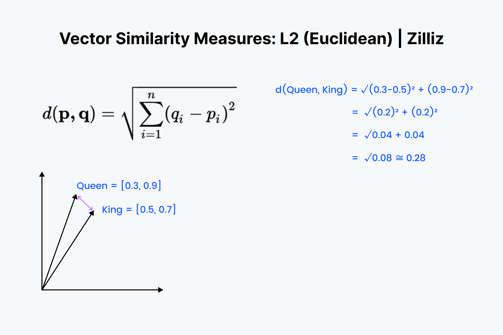
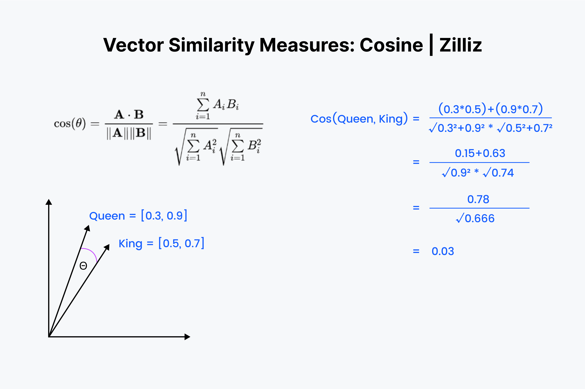
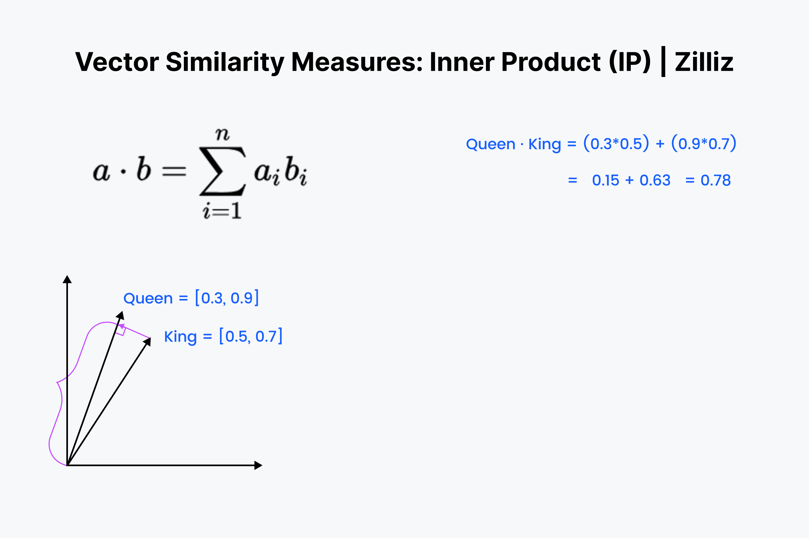
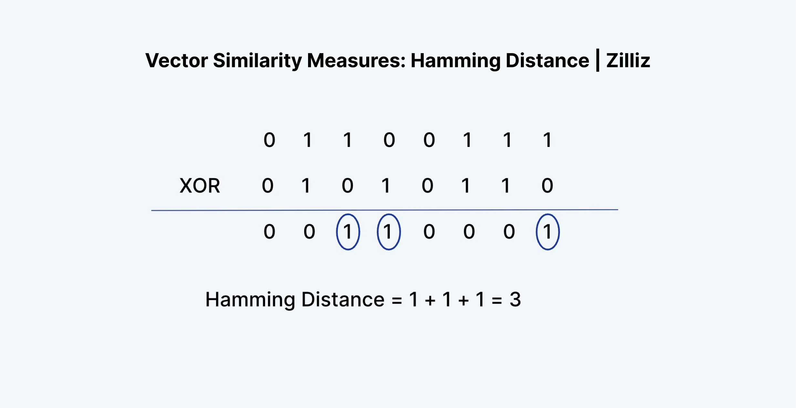
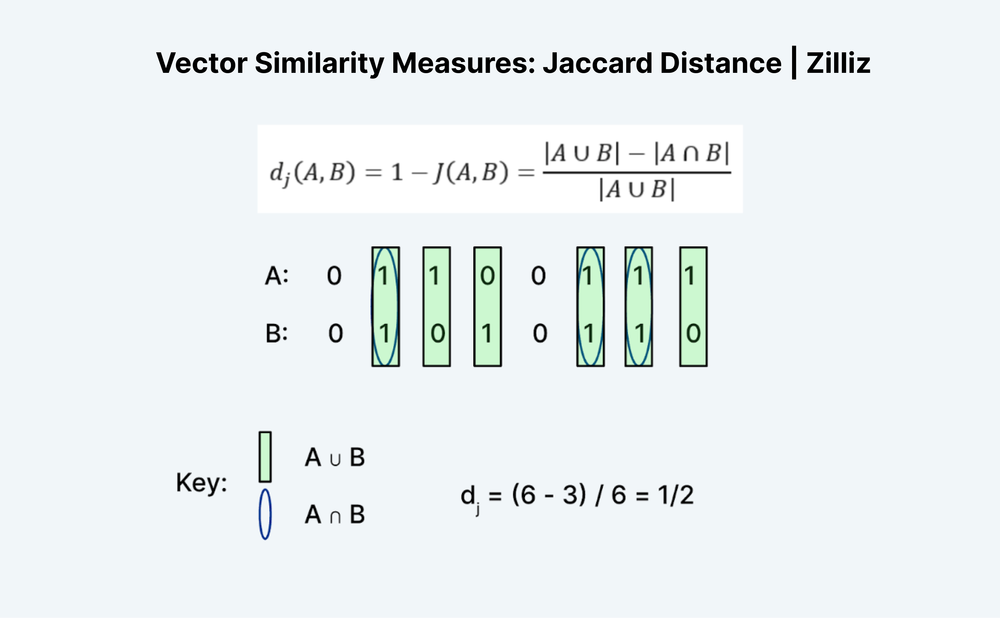
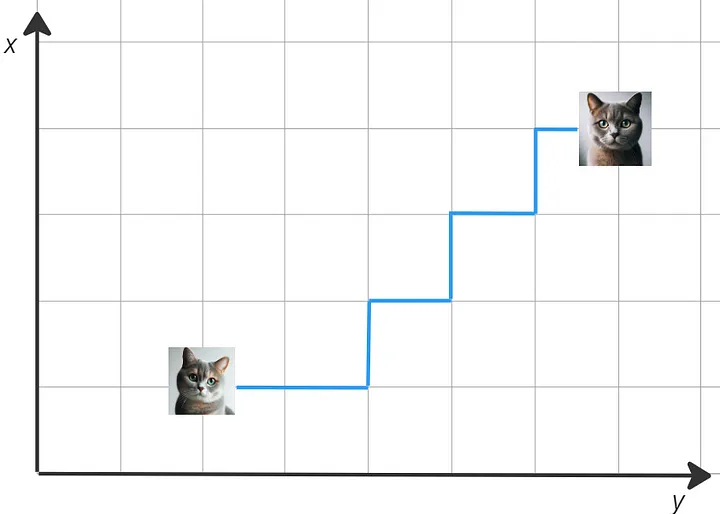
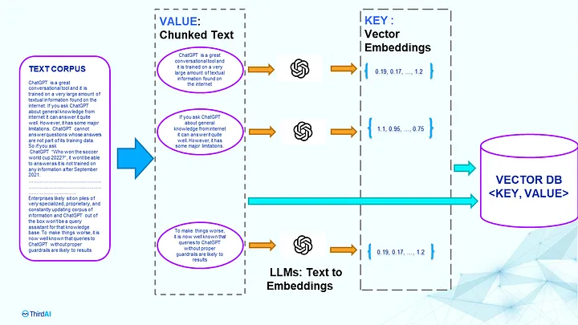
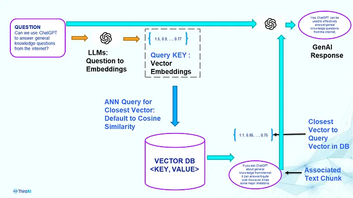

# Vector Search and Embeddings

## Abstract

Vector search and embeddings enable machines to understand and manipulate diverse data types by representing entities like words and documents as vectors in a high-dimensional space and performing operations like similarity search or recommendation based on these representations.

## How it works


Vector search systems rely on three key components: embedding models, vector indexes, and similarity search algorithms.

### Vector Embeddings

An embedding is a compact representation of raw data, such as an image or text, transformed into a vector comprising floating-point numbers. It’s a powerful way of representing data according to its underlying meaning. High-dimensional data is mapped into a lower-dimensional space (think of it as a form of “lossy compression”) that captures structural or semantic relationships within data, making it possible for embeddings to preserve important information while reducing the computational burden that comes with processing large datasets. 

```
[feature11, feature12, feature13, ... feature1n]
[feature21, feature22, feature23, ... feature2n]
[feature31, feature32, feature33, ... feature3n] 
...
[featurem1, featurem2, featurem3, ... featuremn]
```
 @\displaystyle\sum_{i=1}^{m} \sum_{j=1}^{n} feature_{ij}@ - properties represented as **floating point** numbers


Vector embeddings numerically capture the semantic meaning of the objects in relation to other objects. Thus, similar objects are grouped together in the vector space, which means the closer two objects, the more similar they are.

For now, let’s consider a simpler example with numerical representations of words - also called word vectors. In the following image, you can see the words “Wolf” and “Dog” close to each other because dogs are direct descendants of wolves. Close to the dog, you can see the word “Cat,” which is similar to the word “Dog” because both are animals that are also common pets. But further away, on the right-hand side, you can see words that represent fruit, such as “Apple” or “Banana”, which are close to each other but further away from the animal terms.


### Vector Databases

A vector database indexes, stores, and provides access to structured or unstructured data (e.g., text or images) alongside its vector embeddings. It allows users to find and retrieve similar objects quickly at scale in production. 

Vector databases’ search capabilities can be used in various applications ranging from classical Machine Learning use cases, such as natural language processing, computer vision, and recommender systems, to providing long-term memory to LLMs in modern applications.

The most popular use case of vector search engines is naturally for search. Because a vector database can help find similar objects, it is predestined for applications where you might want to find similar products, movies, books, songs, etc. That’s why vector search engines are also used in recommendation systems as a restated task of search. 


### Similarity search

Vector embeddings allow us to find and retrieve similar objects from the vector database by searching for objects that are close to each other in the vector space, which is called vector search, similarity search, or semantic search.

Similarly to how we can find similar vectors for the word "Dog", we can find similar vectors to a search query. For example, to find words similar to the word “Kitten”, we can generate a vector embedding for this query term - also called a query vector - and retrieve all its nearest neighbors, such as the word “Cat”, as illustrated below.


Vector similarity search involves representing data as vectors in a high-dimensional space, organizing them with an index structure for efficient retrieval, and employing a distance metric to measure their similarity. Here's a breakdown:

- Vector Representation: Data such as documents, images, or products are represented as vectors in a multi-dimensional space, where each dimension corresponds to a specific attribute or characteristic.

- Indexing: An index structure is created to organize the vectors, facilitating quick retrieval of similar vectors without needing to compare every pair in the dataset. This is crucial for handling large amounts of data efficiently.

- Distance Metric: A distance metric, like Euclidean distance or cosine similarity, measures the dissimilarity between vectors. The choice of metric depends on the data and application requirements.

- Building the Index: Vectors and the chosen distance metric are used to construct the index structure, which partitions the high-dimensional space into smaller regions for efficient search.

- Querying: A query vector representing the object of interest is compared to indexed vectors using the chosen distance metric. The index structure guides the search to relevant regions, reducing the number of comparisons needed.

- Ranking and Retrieval: Retrieved vectors are ranked based on their similarity to the query vector, determined by the distance metric. Vectors with smaller distances are considered more similar and ranked higher.

- Post-processing: Additional steps like filtering and ranking algorithms can refine search results based on application requirements, such as personalizing recommendations in recommendation systems.

Several types of distance metrics can be used in vector similarity search, each with strengths and weaknesses. The choice of distance metric will ultimately depend on the specific application and the type of data being analyzed.

1. **Squared Euclidean or L2-squared** 

The most intuitive distance metric is L2 or Euclidean distance. We can imagine this as the amount of space between two objects. For example, how far your screen is from your face.



*When Should You Use L2 or Euclidean Distance?*

One of the main reasons to use Euclidean distance is when your vectors have different magnitudes. You primarily care about how far your words are in space or semantic distance.

2. **Cosine similarity** 

We use the term “cosine similarity” or “cosine distance” to denote the difference between the orientation of two vectors. For example, how far would you turn to face the front door?



*When Should You Use Cosine Similarity?*

Cosine similarity is primarily used in NLP applications. The main thing that cosine similarity measures is the difference in semantic orientation. If you work with normalized vectors, cosine similarity is equivalent to the inner product.

3. **Inner Product** 

The inner product is the projection of one vector onto the other. The inner product's value is the vector's length drawn out. The bigger the angle between the two vectors, the smaller the inner product. It also scales with the length of the smaller vector. So, we use the inner product when we care about orientation and distance.



*When Should You Use Inner Product?*

The inner product is like a cross between Euclidean distance and cosine similarity. When it comes to normalized datasets, it is the same as cosine similarity, so IP is suited for either normalized or non-normalized datasets. It is a faster option than cosine similarity, and it is a more flexible option.

One thing to keep in mind with Inner Product is that it doesn’t follow the triangle inequality. Larger lengths (large magnitudes) are prioritized. This means we should be careful when using IP with Inverted File Index or a graph index like HNSW.

4. **Hamming distance**

Hamming distance measures the distance between two vectors based on the number of positions at which the corresponding elements of the vectors are different. Hamming Distance works on binary data.



*When Should You Use The Hamming Distance?*

Hamming distance is good to measure something like the difference in wording between two texts, the difference in the spelling of words, or the difference between any two binary vectors. But it’s not good for measuring the difference between vector embeddings.


5. **Jaccard Similarity** 

Jaccard similarity measures the similarity between two sets based on the size of their intersection and union. It’s calculated as the size of the intersection divided by the size of the union. This method also works on binary data.



*When Should You Use Jaccard Similarity?*

 Jaccard Similarity is used to determine the similarity between two sets, while Jaccard Distance is used to measure the dissimilarity between two sets. They are commonly used in Natural Language Processing (NLP) to compare and analyze text data. However, Jaccard Similarity has certain limitations when applied to NLP, such as the bag-of-words problem and the inability to consider word importance.

5. **Manhattan or L1 distance** 

Manhattan distance measures the distance between two vectors based on the sum of the absolute differences between their corresponding elements.

@d(\mathbf{p}, \mathbf{q}) = \sum_{i=1}^{n} |p_i - q_i|@



This type of vector similarity is applicable in various scenarios where you want to measure the distance or dissimilarity between two points in a grid-based system, especially when movement is constrained to horizontal and vertical paths.

### Usage with LLM's

**The Preprocessing Step Overview**: You need to store both text and vector embedding in the database with vectors being the KEY. The process requires an LLM to convert text chunk to vectors. The LLM should be the same for querying. 

*Caution*: Any changes or updates to the LLM requires re-indexing everything in the Vector DB. You need exact same LLM for querying. Changing dimensions are not allowed. Privacy Risk: All the text needs to go to both the embedding models and the vector database. Costly: Every token in the complete text corpus goes to both LLM and Vector DB.




**The Q &A Phase**: You need the exact same LLM for the question embedding that was used while indexing text chunks. The LLM cannot be modified after indexing. Any training, tuning, will make the search process unusable because the ANN over KEYs may not be consistent. If you want to update or change the LLM you need to reindex. 

*Caution*: The query latency is the sum of Embedding latency + Vector DB Query Latency + GenAI’s text generative Latency.



## Use Cases

1. **Long-term Memory for LLM Applications**: Vector embeddings can be utilized to store and retrieve historical user conversations, allowing LLMs to maintain context and continuity in interactions over time. By encoding past interactions into vector representations, LLMs can recall relevant information from previous conversations, enhancing user experiences in dialogue systems, virtual assistants, and chatbots.

2. **Recommendation Systems**: Vector embeddings can represent user preferences or item features, enabling recommendation systems to suggest relevant products, movies, music, or articles based on similarity between vectors representing users and items.

3. **Anomaly Detection**: In various domains such as cybersecurity or finance, vector embeddings can be used to represent normal behavior patterns. Anomalies can then be detected by measuring the distance of a new data point from the nearest known embeddings.

4. **Document Similarity and Clustering**: Vector embeddings of documents can be used to measure document similarity or perform document clustering. This is useful in information retrieval, plagiarism detection, and topic modeling.

5. **Image Retrieval and Similarity Search**: Vector embeddings of images can be used for reverse image search, content-based image retrieval, or finding visually similar images in a database.

6. **Semantic Search**: In natural language processing (NLP), vector embeddings of text can be used to perform semantic search, where documents or sentences with similar meanings are retrieved based on the similarity of their embeddings.

7. **Personalization and Content Filtering**: Vector embeddings of user profiles and content items can be used to personalize user experiences by recommending content tailored to individual preferences, improving content filtering, and increasing user engagement.

8. **Feature Extraction for Machine Learning**: Vector embeddings can be used as feature representations in machine learning models, enabling better generalization and performance on tasks such as classification, regression, and clustering.
## Implementations

*Vector Libraries:*

1. **FAISS (Facebook AI Similarity Search)**

FAISS, developed by Facebook’s AI team, is an open-source library specialized in efficient similarity search and clustering of dense vectors. It’s particularly well-suited for large-scale vector search tasks and is used extensively in AI research for tasks like image and video retrieval. FAISS excels in handling high-dimensional data but does not directly support structured data types like SQL or JSON. It’s primarily a library, not a full-fledged database, and does not offer hosted or cloud services.

Pros:

- Optimized for large-scale vector search, efficient in handling high-dimensional data.

- GPU support enhances performance in AI-driven applications.

- Open-source and widely used in the AI research community.

Cons:

- Primarily a library, not a standalone database; requires integration with other systems.

- Limited to vector operations, lacks broader database management features.

- May require technical expertise to implement and optimize.

2. **ANNOY (Approximate Nearest Neighbors Oh Yeah)**

ANNOY, another open-source project, is designed for memory-efficient and fast approximate nearest neighbor searches in high-dimensional spaces. Developed by Spotify, it’s commonly used in scenarios where quick, approximate results are sufficient. ANNOY is a library rather than a database and doesn’t provide hosting services. It’s focused on vector operations and doesn’t natively support structured data types like SQL.

Pros:

- Fast and memory-efficient for approximate nearest neighbor searches.

- Particularly effective in high-dimensional spaces.

- Open-source and easy to integrate with other systems.

Cons:

- Focuses on approximate results, which might not be suitable for applications requiring high accuracy.

- As a library, it lacks comprehensive database functionalities.

- Limited support for structured data types.

3. **SCANN (Scalable Nearest Neighbors)**

SCANN, developed by Google Research, is an open-source library that specializes in large-scale nearest neighbor search. It offers a balance between accuracy and efficiency in high-dimensional space and is designed for use cases requiring precise vector search capabilities. Like FAISS and ANNOY, SCANN is a library focused on vector operations and doesn’t provide native support for structured data types or hosted services.

Pros:

- Balances accuracy and efficiency in vector search.

- Developed by Google Research, bringing credibility and robustness.

- Suitable for large-scale, precise vector search tasks.

Cons:

- Complexity in implementation and tuning for optimal performance.

- Primarily a search library, not a complete database solution.

- Lacks native support for structured data types.


*Vector Only Databases*

1. **Pinecone**

Pinecone is a vector database service designed for scalable, high-performance similarity search in applications such as recommendation systems and AI-powered search. As a fully managed cloud service, Pinecone simplifies the deployment and scaling of vector search systems. It primarily focuses on vector data but may support integration with other data types and systems.

Pros:

- Designed for scalable, high-performance similarity search.

- Fully managed cloud service, simplifying deployment and scaling.

- Suitable for AI-powered search and recommendation systems.

Cons:

- Being a specialized service, it might not cover broader database functionalities.

- Relatively newer product and struggles with production database grade features.

- Potential dependency on cloud infrastructure and related costs.

2. **Weaviate**

Weaviate is an open-source, graph-based vector database designed for scalable semantic search. It supports a variety of data types, including unstructured data, and can integrate with machine learning models for automatic vectorization of data. Weaviate offers both cloud and self-hosted deployment options and is suited for applications requiring a combination of graph database features and vector search.

Pros:

- Combines graph database features with vector search.

- Open source with support for various data types and automatic vectorization.

- Flexible deployment options, including cloud and self-hosted.

Cons:

- Complexity in setup and management due to its combination of graph and vector features.

- May require additional resources to handle large-scale deployments effectively.

- The unique combination of features might have a steeper learning curve.

3. **Milvus**

Milvus is an open-source vector database, optimized for handling large-scale, high-dimensional vector data. It supports a variety of index types and metrics for efficient vector search and can be integrated with various data types. Milvus can be deployed on-premises or in the cloud, making it versatile for different operational environments.

Pros:

- Open-source and optimized for handling large-scale vector data.

- Supports various index types and metrics for efficient search.

- Versatile deployment options, both cloud and on-premises.

Cons:

- Focuses mainly on vector data, with limited support for other data types.

- May require tuning for specific use cases and datasets.

- Managing large-scale deployments can be complex.

4. **ChromaDB**

Chroma db is an open source vector only database.

Pros:

- Suitable for applications requiring high throughput and low latency in vector searches.

- Optimized for GPU acceleration, enhancing performance in AI-driven applications.

Cons:

- It is meant for smaller workloads and prototype applications. It may not be suitable for petabyte scale of data.

5. **Qdrant**

Qdrant is an open-source vector search engine that supports high-dimensional vector data. It’s designed for efficient storage and retrieval of vector data and offers features like filtering and full-text search. Qdrant can be used in cloud or on-premises environments, catering to a range of applications that require efficient vector search capabilities.

Pros:

- Open-source and designed for efficient vector data storage and retrieval.

- Offers features like filtering and full-text search.

- Can be used in both cloud and on-premises environments.

Cons:

- Being a specialized vector search engine, it might lack some broader database management functionalities.

- Might require technical know-how for optimization and deployment.

- As a newer product, it may have a smaller community and fewer resources compared to established databases.

6. **Vespa**

Vespa, an open-source big data serving engine developed by Yahoo, offers capabilities for storing, searching, and organizing large datasets. It supports a variety of data types, including structured and unstructured data, and is well-suited for applications requiring real-time computation and data serving. Vespa can be deployed in both cloud and self-hosted environments.

Pros:

- Developed by Yahoo, providing robustness and reliability.

- Supports a variety of data types and suitable for large data sets.

- Real-time computation and data serving capabilities.

Cons:

- Complexity in configuration and management due to its extensive feature set.

- May require significant resources for optimal performance.

- The broad range of features might be overkill for simpler applications.

*Enterprise DBs with Vectors*

1. **Elastic (Elasticsearch)**

Elasticsearch is a widely used, open-source search and analytics engine known for its powerful full-text search capabilities. It supports a wide range of data types, including JSON documents, and offers scalable search solutions. Elasticsearch can be deployed on the cloud or on-premises and has expanded its capabilities to include vector search, making it suitable for a variety of search and analytics applications.

Pros:

- Powerful full-text search capabilities and scalable search solutions.

- Support for both text-based and vector based semantic search.

- Open source with wide adoption and a strong community.

- Supports a variety of data types.

Cons:

- Elastic uses ELSER, a black box model for vector search. This does not offer granular control as you would get in using your own embedding and search models.

- Can be resource-intensive, especially for large clusters.

- Complexity in tuning and maintaining for large-scale deployments.

- As a search engine, it may require additional components for complete database functionalities.

2. **Mongo (MongoDB)**

MongoDB is a popular open-source, document-based database known for its flexibility and ease of use. It supports a wide range of data types, primarily JSON-like documents. MongoDB offers cloud-based services (MongoDB Atlas) as well as on-premises deployment options. While traditionally focused on document storage, MongoDB has been incorporating more features for handling vector data.

Pros:

- Flexible and easy to use, with strong support for JSON-like documents.

- Scalable and widely adopted in various industries.

- Offers cloud-based services and on-premises deployment options.

Cons:

- Not traditionally focused on vector search; newer in this area.

- Document-oriented model may not be ideal for all use cases, especially analytics based.

- Performance can vary based on workload and data model.

3. **SingleStore (formerly MemSQL)**

SingleStore (formerly MemSQL) is a commercial database known for its high performance and scalability. It combines in-memory database technology with support for structured SQL queries, making it suitable for a variety of applications, including real-time analytics and transaction processing. SingleStore offers both cloud-based and on-premises deployment options.

Pros:

- Support for multiple data types like SQL, JSON (MongoDB API compatible), Geospatial, Key-Value and others

- Stores data in patented row and columnar based storage making it extremely capable for both transactional and analytics use cases.

- High performance and scalability, suitable for milliseconds response times.

- Combines in-memory database technology with SQL support.

- Offers both cloud-based and on-premises deployment options.

Cons:

- No support for Graph data type.

- Not ideal for simple prototypical applications.

4. **Supabase**

Supabase is an open-source Firebase alternative, providing a suite of tools for building scalable web and mobile applications. It offers a PostgreSQL-based database with real-time capabilities and supports a wide range of data types, including SQL. Supabase offers cloud-hosted services and is known for its ease of use and integration with various development tools.

Pros:

- Open-source alternative to Firebase, offering a suite of tools for application development.

- Real-time capabilities and supports a range of data types including SQL.

- Cloud-hosted services with ease of use and integration.

Cons:

- Being a relatively new platform, might have growing pains and evolving features.

- Dependence on PostgreSQL may limit certain types of scalability.

- Community and third-party resources are growing but not as extensive as more established databases.

5. **Neo4J**

Neo4J is a commercial graph database known for its powerful capabilities in managing connected data. It supports a variety of data types, with a focus on graph structures, and is used in applications requiring complex relationship mapping and queries. Neo4J can be deployed in both cloud-based and on-premises environments.

Pros:

- Powerful for managing connected data with graph structures.

- Used in complex relationship mapping and queries.

- Flexible deployment with cloud-based and on-premises options.

Cons:

- Specialized in graph database functionalities, which might not suit all use cases especially transactional, or analytics use cases.

- Can be resource-intensive, especially for large graphs.

- Graph databases generally have a steeper learning curve.

6. **Redis**

Redis is an open-source, in-memory data structure store, used as a database, cache, and message broker. It supports various data types, such as strings, hashes, lists, and sets. Redis is known for its speed and is commonly used for caching, session management, and real-time applications. It offers both cloud-hosted and self-hosted deployment options.

Pros:

- Extremely fast, in-memory data structure store.

- Versatile as a database, cache, and message broker.

- Wide adoption with strong community support.

Cons:

- In-memory storage can be limiting in terms of data size and persistence requirements. In addition, memory is still very expensive for all data use cases.

- Data models may not be suitable for complex relational data structures.

- Managing persistence and replication can be complex in larger setups.

7. **Postgres (PostgreSQL)**

PostgreSQL is a powerful, open-source object-relational database system known for its reliability, feature robustness, and performance. It supports a wide range of data types, including structured SQL data and JSON. PostgreSQL can be deployed on-premises or in the cloud and is widely used in a variety of applications, from small projects to large-scale enterprise systems. With the use of pgvector, you can use Postgres as a vector database. With pgvector, you can use Postgres as a vector database. Google, AWS and Azure each have versions of Postgres and pgvector offered as a service — AlloyDB, Aurora Postgres and Azure SQL Hyperscale respectively.

Pros:

- Robust, feature-rich, and reliable object-relational database system.

- Wide range of supported data types, including structured SQL and JSON.

- Open source with extensive community support and resources.

Cons:

- Can be resource-intensive and expensive for large-scale deployments.

- Does not support both transactional and analytics use cases.

- The complexity of features can lead to a steeper learning curve for new users.

*Other Libraries*

1. **OpenAI Embeddings**

Helps retrieve vector information from text and comparison algorthims

Details: https://platform.openai.com/docs/guides/embeddings/what-are-embeddings

2. **Azure AI Search**

Azure AI Search (formerly known as "Azure Cognitive Search") provides secure information retrieval at scale over user-owned content in traditional and generative AI search applications.

Details: https://learn.microsoft.com/en-us/azure/search/search-what-is-azure-search

## Advantages

1. **Speed and Efficiency in Searching**

Vector databases are like the sports cars of the data world, built for speed, agility, and precision. When dealing with high-dimensional data, traditional methods can be painfully slow. 

2. **Flexibility in Handling Different Types of Data**

Not all data fits neatly into rows and columns. Vector databases shine when it comes to handling different types of data, such as images, sounds, texts, or any complex, multi-dimensional data.

3. **Integration with Machine Learning and AI Applications**

Vector databases are not just standalone entities; they are part of a broader ecosystem that includes machine learning and AI.

4. **Integration with Modern Tools**

Today's vector databases are not isolated entities; they thrive in collaboration with other modern tools and platforms

## Limitations/Disadvantages

1. **Loss of Transparency and Hidden Bias**: The inner workings of vector search engines are often opaque since they rely on pre-trained LLMs to vectorize the content. This lack of transparency can be a drawback in scenarios where you must explain or justify search results, such as in regulatory compliance or auditing processes. In these situations, the inability to explain clearly how the vector search engine arrived at specific results can raise concerns regarding bias or unfairness. Additionally, the lack of transparency can hinder efforts to identify and rectify potential issues or biases in the search algorithm.

2. **Challenges in Specialized and Niche Contexts**: Vector search encounters difficulties with rare or niche items, struggles to capture nuanced semantic meanings, and may need more precision in highly specialized fields. This limitation can lead to suboptimal search results in industries where precise terminology is crucial, like legal, healthcare, or scientific research. In this instance, a graph-based semantic search engine would be ideal because it could leverage an ontology to capture the intricate relationships and connections between specialized terms and concepts defined in an industry or enterprise taxonomy.

3. **Performance vs. Accuracy Trade-off**: LLM-based content vectorization can provide vectors of varying dimensions. The higher the dimensionality, the more information can be kept in vectors, resulting in more exact search results. The high dimensionality, however, comes at a higher processing cost and slower response times. As a result, vector search engines use approximate closest neighbor (ANN) techniques to accelerate the process while sacrificing some search precision. These algorithms provide outcomes similar, but not identical, to their nearest neighbors. It’s a trade-off between speed and precision, and organizations must decide how much precision they’re willing to give up for faster search speeds. Also, changes to the LLM used for embedding require re-indexing of the whole Vector DB.

4. **Privacy Concerns**: Handling sensitive or personal data with vector search engines, especially when using APIs to access and train LLM services, may raise privacy concerns. If not carefully managed, the training and utilization of such models could result in unintentional data exposure, leading to data breaches or privacy violations.

5. **Cost Awareness**: Cost by token for embedding, cost of dimensionality of vector...

## Alternatives

- [Neural Database](https://medium.com/thirdai-blog/neural-database-next-generation-context-retrieval-system-for-building-specialized-ai-agents-with-861ffa0516e7)
  - Why: The key concept is to bypass the embedding process entirely and approach the retrieval problem as a neural prediction system that can be learned end-to-end
  - Implementations:
    - [ThirdAI Neural DB](https://www.thirdai.com/neuraldb/)
  - Papers:
    - [NeurIPS-2019](https://proceedings.neurips.cc/paper_files/paper/2019/file/69cd21a0e0b7d5f05dc88a0be36950c7-Paper.pdf)
    - [KDD-2022](https://dl.acm.org/doi/10.1145/3534678.3539414)


## Formal Definitions

- **Vector Embeddings**: Vector embeddings numerically capture the semantic meaning of the objects in relation to other objects. Thus, similar objects are grouped together in the vector space, which means the closer two objects, the more similar they are.

- **Vector Search**: Vector embeddings allow us to find and retrieve similar objects from the vector database by searching for objects that are close to each other in the vector space, which is called vector search, similarity search, or semantic search.

- **Vector Indexing**: the underlying idea is to pre-calculate the distances between the vector embeddings and organize and store similar vectors close to each other (e.g., in clusters or a graph), so that you can later find similar objects faster

## Useful Links

- [The Ultimate Guide to Vector Database Landscape — 2024 and Beyond](https://medium.com/madhukarkumar/the-ultimate-guide-to-vector-databases-2024-and-beyond-16dfb15bef12)
- [A Gentle Introduction to Vector Databases](https://weaviate.io/blog/what-is-a-vector-database)
- [A Beginner’s Guide to Vector Embeddings](https://weaviate.io/blog/what-is-a-vector-database)
- [OpenAI Cookbook: List of Vector Databases](https://cookbook.openai.com/examples/vector_databases/readme)
- [What is a vector database](https://weaviate.io/blog/what-is-a-vector-database)
- [From prototype to production: Vector databases in generative AI applications](https://stackoverflow.blog/2023/10/09/from-prototype-to-production-vector-databases-in-generative-ai-applications/)
- [An intuitive introduction to text embeddings](https://stackoverflow.blog/2023/11/09/an-intuitive-introduction-to-text-embeddings/)
- [How vector search and semantic ranking improve your GPT prompts](https://youtu.be/Xwx1DJ0OqCk)
- [Vector search and state of the art retrieval for Generative AI apps](https://youtu.be/lSzc1MJktAo)
- [Vector Database Fireship](https://youtu.be/klTvEwg3oJ4)
- [Azure Implementation of Vector/Keyword Search Example](https://gist.github.com/pablocastro/90677135ddbd1f8a4783006f6e890edf)
- [OpenAI Embeddings and Vector Databases Crash Course](https://youtu.be/ySus5ZS0b94)
- [Understanding the Fundamental Limitations of Vector-Based Retrieval for Building LLM-Powered Chatbots](https://medium.com/thirdai-blog/understanding-the-fundamental-limitations-of-vector-based-retrieval-for-building-llm-powered-48bb7b5a57b3)
- [Semantic Search in the Context of LLMs](https://medium.com/@zahmed333/semantic-search-in-the-context-of-llms-7961308cd6ad)
- [Comprehensive Guide To Approximate Nearest Neighbors Algorithms](https://towardsdatascience.com/comprehensive-guide-to-approximate-nearest-neighbors-algorithms-8b94f057d6b6)

---

_Written by Mark Doszlop_
